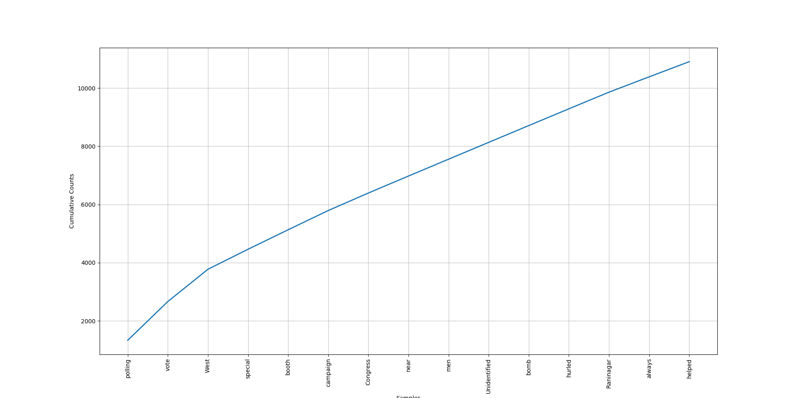

# LokSabhaElection2019
Using NLP to analyze public sentiments on the general election 2019 in India

India the largest democracy is going through basic requirement of being a democracy, i.e. ELection. It is a more than a month long marathon project for a country of population more than 1.3 Billion and more than 900 M people directly franchising their voting rights.

One of the more through which people express their expectation and reaction are twits. 

This python project is an attempt to analyze twits and other media information to understand the people's expectation changing over time and demographically.

First Analysis

The graph below shows most prominent 15 words used in the tweets.

The picture below shows the various prominent strong words being used the tweets.

Disclaimer: 
1. The result is purely for academic purpose
2. The result has been obtained by analyzing 10,000 tweets on random basis which contains words LokSabhaElection2019