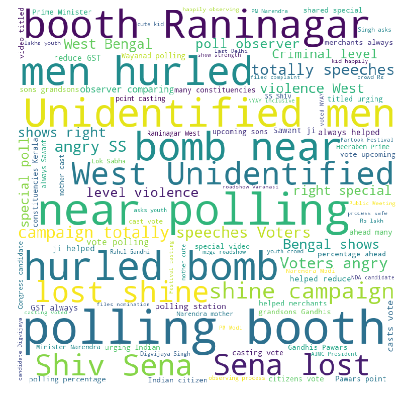
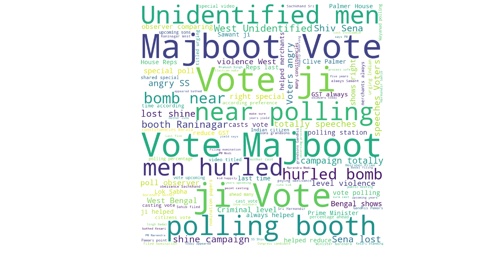
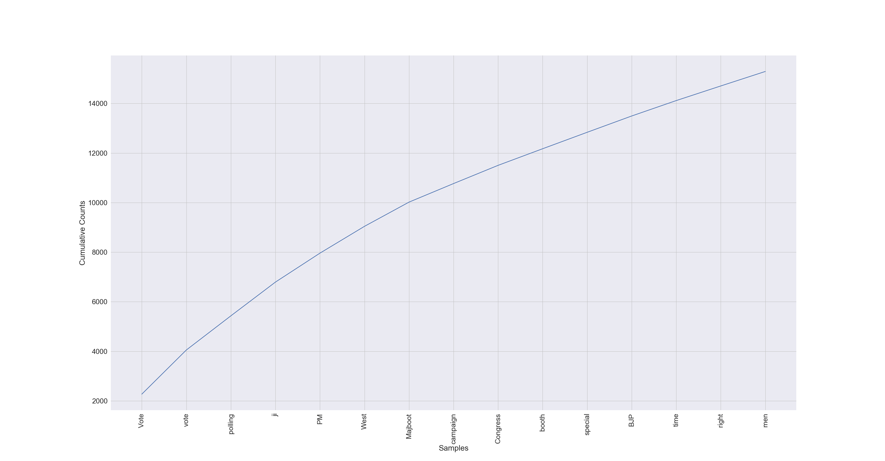
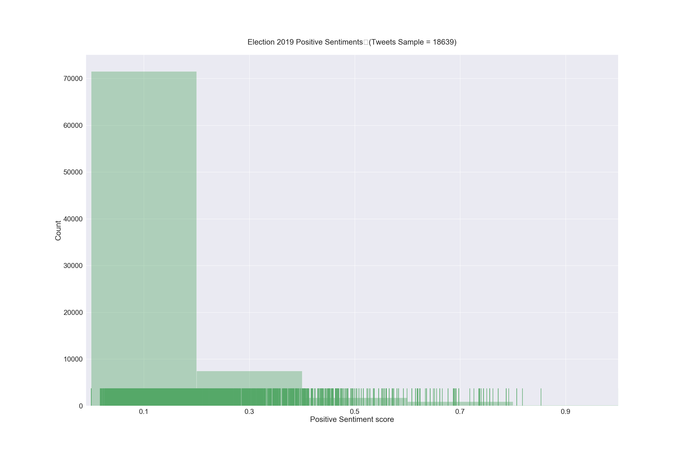
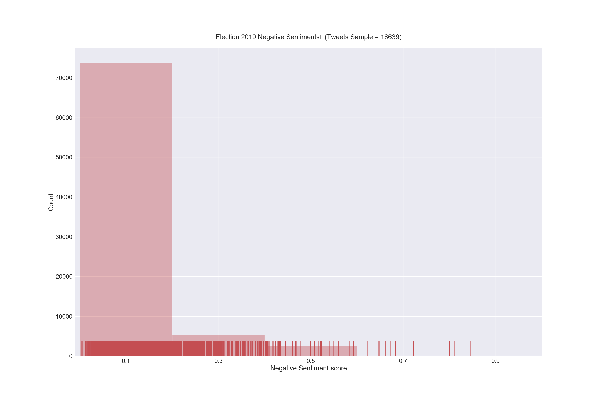
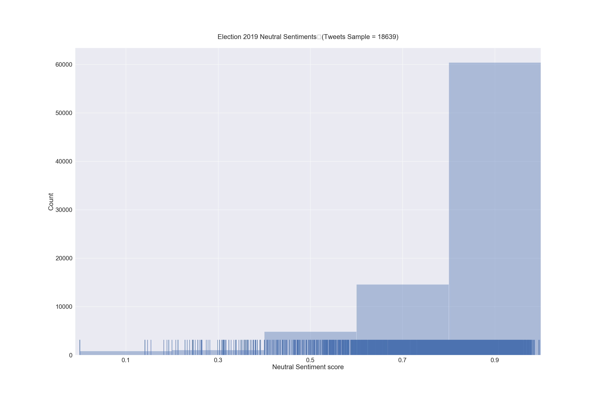

# LokSabhaElection2019
Using NLP to analyze public sentiments on the general election 2019 in India

India the largest democracy is going through basic requirement of being a democracy, i.e. ELection. It is a more than a month long marathon project for a country of population more than 1.3 Billion and more than 900 M people directly franchising their voting rights.

One of the more through which people express their expectation and reaction are twits. 

This python project is an attempt to analyze twits and other media information to understand the people's expectation changing over time and demographically.

First Analysis 20190426

The graph below shows most prominent 15 words used in the tweets.

The picture below shows the various prominent strong words being used the tweets.

Second Analysis 20190427

On iclusion of more samples with a target of total 30,000 tweet samples, the result seem to be diferent. The workcloud itself is totally differnet and showing strnog positive sentiment compared to the earlier analysis. The wordcloud is presented below

Addiitonally, the frequently used words are also showing some new words in the list of top 15 words with BJP coming in the show. However, it is still lagging behind Congress for whatever reasons in the lsit.

New frequent wordlist

Also present are the barchart showing Positive, Negative and Neutral sentiments in tweets analuzed.

Disclaimer: 
1. The result is purely for academic purpose
2. The result has been obtained by analyzing tweets on random basis which contains words LokSabhaElection2019